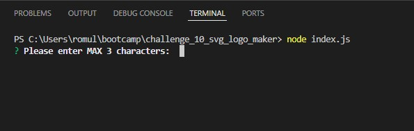
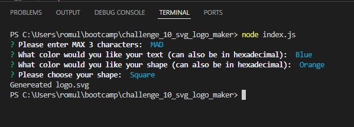

# CHALLENGE 10 SVG LOGO MAKER

## DESCRIPTION
Have you ever just wanted to have a logo? Well now you can! With this program, you can create a simple SVG logo, containing 3 letters. All you have to do is enter 1-3 letters that you would like to have on your logo. Then you will be prompted what colors your would like the text and the shape color to be. Then finally you will be able to choose from 3 different shapes, a circle, a square, and a triangle. Once all these are completed, the program will generate you a SVG logo.

## HOW TO USE
To use this program, it is simple. You must first have node installed. To check if you have it installed, open a new terminal, type 'node --version'. If you have it installed, you should see a version number. If you do not have node installed, then head over to 'https://nodejs.org/en/download'. Download the correct node for your operating system and install. After you have node installed, in your VSCode, open a new terminal and clone this program from my GitHub. Once cloned, type 'node index.js' to open the program.

After the program has been executed you will be prompted with a series of questions. Answer the following prompts to your liking. After all questions are answered, you will have created a new SVG logo.

## ACCEPTANCE CRITERIA
GIVEN a command-line application that accepts user input\
WHEN I am prompted for text\
THEN I can enter up to three characters\
WHEN I am prompted for the text color\
THEN I can enter a color keyword (OR a hexadecimal number)\
WHEN I am prompted for a shape\
THEN I am presented with a list of shapes to choose from: circle, triangle, and square\
WHEN I am prompted for the shape's color\
THEN I can enter a color keyword (OR a hexadecimal number)\
WHEN I have entered input for all the prompts\
THEN an SVG file is created named `logo.svg`\
AND the output text "Generated logo.svg" is printed in the command line\
WHEN I open the `logo.svg` file in a browser\
THEN I am shown a 300x200 pixel image that matches the criteria I entered

## VIEWING MY PROJECT
Link to Deployed Application: <i>https://github.com/rapostoljr/challenge_10_svg_logo_maker.git</i>
